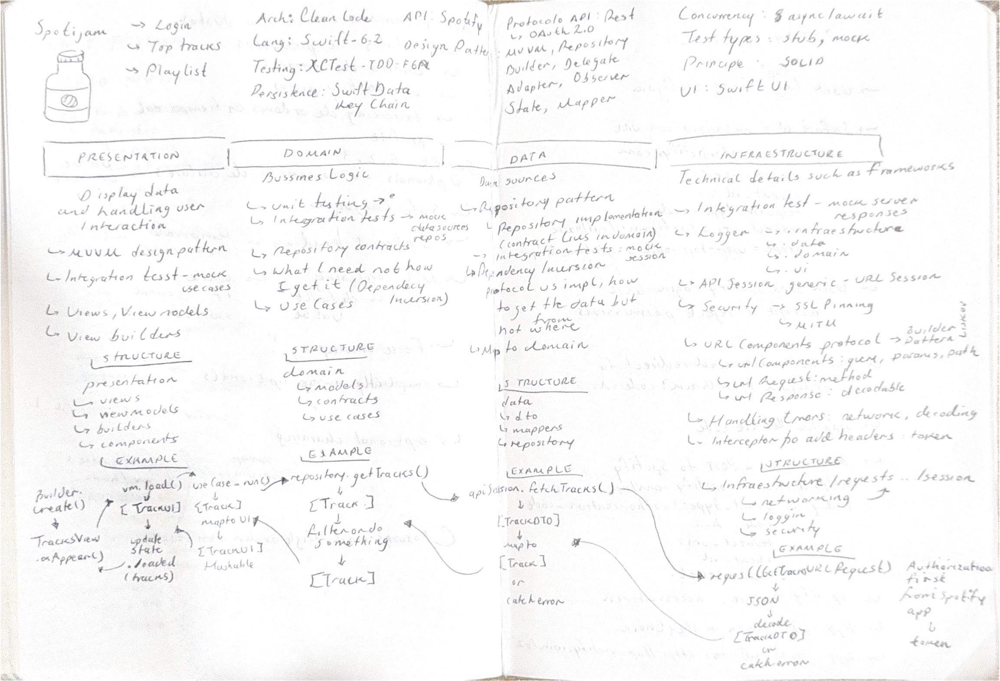
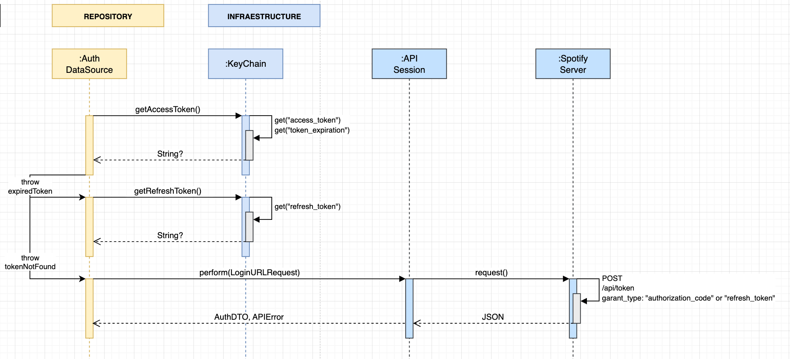

# Spotijam
A project to practice interview concepts in iOS

### Main features
- Login
- Top tracks
- Save tracks in a playlist

### Draw notes
[Inspired in Excalidraw]

### Architecture Diagram
[draw.io in process...]

Currently I'm designing how the Spotijam app will handle the `access_token` and `token_refresh` provide them by the Spotfy API. This piece of diagram considers a SplashView as entry point.

1. When the user opens the app, the `AuthDataSource` will validate the session. If there is not an `access_token`, it will perform a login request using the garant type: "authorization_code".
2. If there is an `access_token` but is expired, the `AuthDataSource` will get the `refresh_token` to fetch a new `acces_token`.
3. Finally if there is a valid `access_token`, the app will continue to the home and perform requests.
